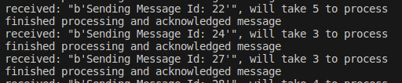
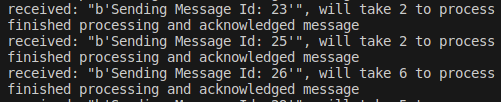
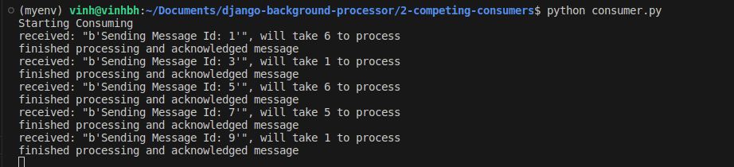
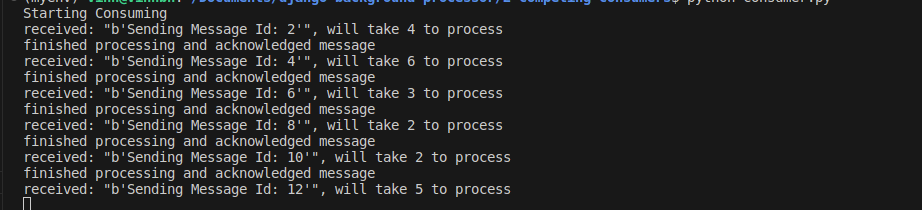

# 2. Competing consumers

## Kịch bản
- Chạy 1 instance producer random thời gian gửi message
- Chạy 2 instance consumer random thời gian xử lý message

## Thiết lập prefetch

Chú ý:

- Bỏ đi auto_ack = True, để tự động gửi ack về khi hoàn thành, thay vì gửi ack tự động

From 
```
channel.basic_consume(queue='letterbox', auto_ack=True,
    on_message_callback=on_message_received)
```
To

```
def on_message_received(ch, method, properties, body):
    processing_time = random.randint(1, 6)
    print(f'received: "{body}", will take {processing_time} to process')
    time.sleep(processing_time)
    ch.basic_ack(delivery_tag=method.delivery_tag) # chủ động gửi ack khi hoàn thành
    print(f'finished processing and acknowledged message')


channel.basic_consume(queue='letterbox', on_message_callback=on_message_received)
```

### prefetch

Trong file consumer.py, nếu thiết lập
```
channel.basic_qos(prefetch_count=1) # quality of service
```

thì mỗi consumer chỉ đồng thời xử lý tối đa 1 message, nên có thể xảy ra không đều nhau (1-3-5-7-...)

consumer1



consumer2



Nếu không thiết lập channel.basic_qos(prefetch_count=1) sẽ mặc định là round robin và phải chờ xử lý xong

consumer1



consumer2

