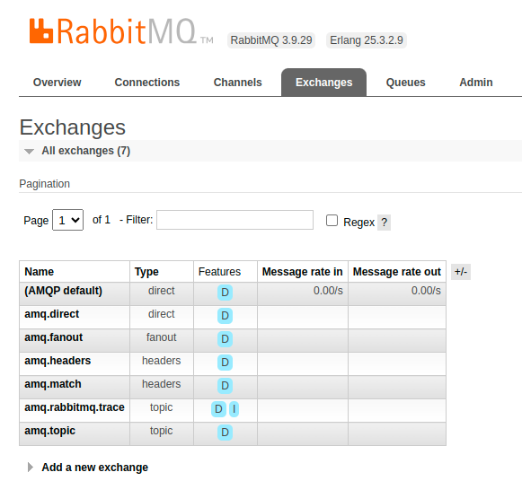

# Pub/sub pattern

Pub/sub ngược lại với competing-comsumers

Pub/sub sẽ gửi trùng lặp 1 message tới nhiều consumers khác nhau

Ví dụ, trong triển khai microservices

- khi có 1 message có `user created`
- service lưu thông tin người dùng cũng quan tâm tới message này
- service quản lý khuyến mại cũng quan tâm tới message này
- cả 2 service đều muốn nhạn được message `user created` và đồng thời xử lý
- và producer cũng không muốn gửi trực tiếp tới từng service muốn nhận

Có khá nhiều loại exchange khác nhau

Về cơ bản, các exchange đều nhận mesages từ producer và gửi nó vào queue, tùy vào type của exchange mà sẽ gửi tới single queue, multiple queue hoặc discarded message hay không, ...

fan out exchange sẽ publish message tới multiple queues

Nhiều queue khác nhau chứa những message trùng lặp, nhưng chỉ tham chiếu tới 1 message gốc, do đó ko tiêu tốn nhiều bộ nhớ