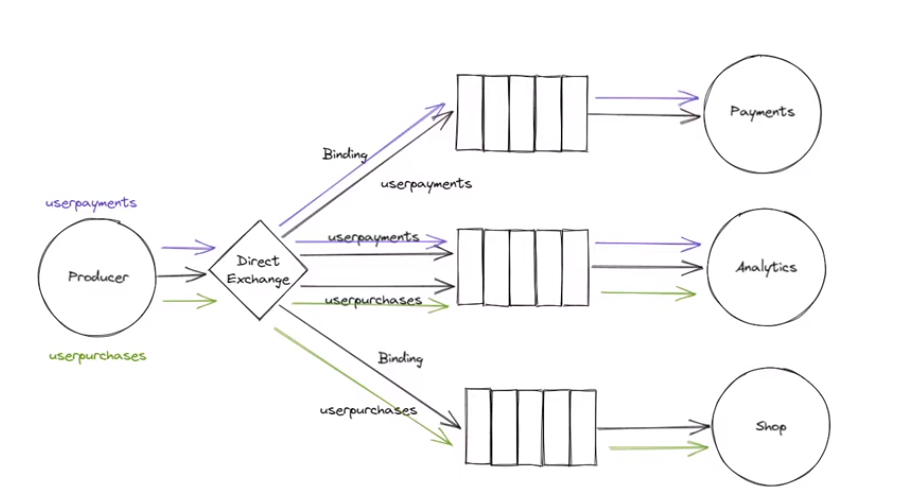
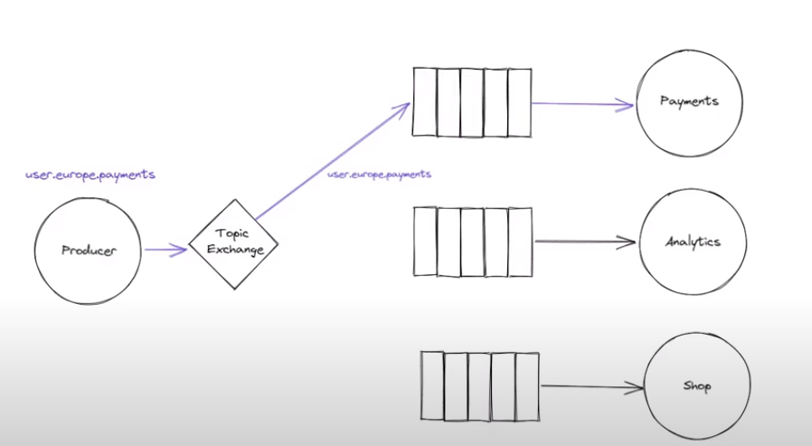
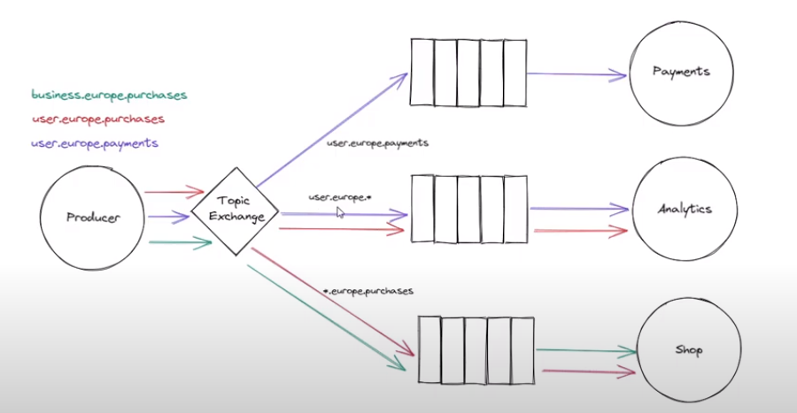
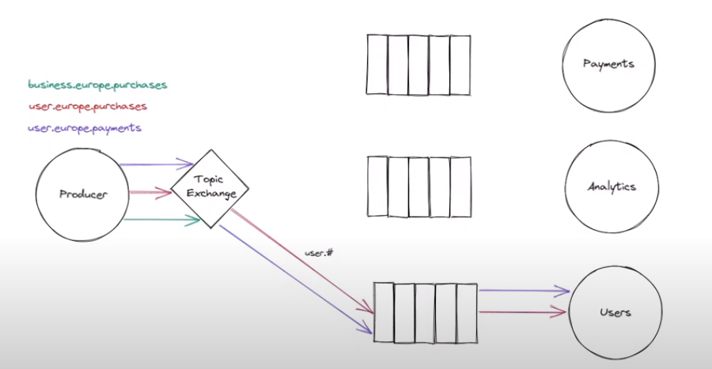
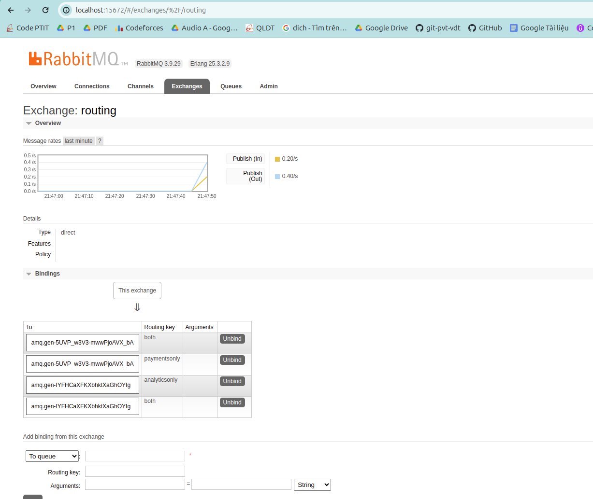
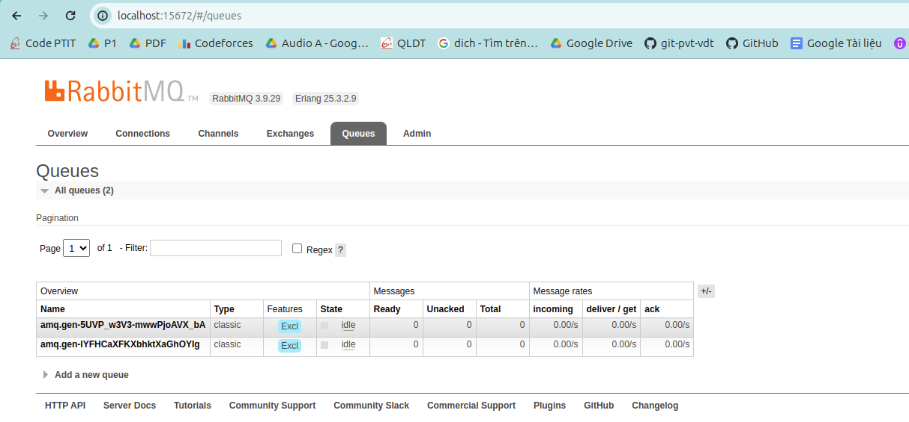

# Routing

## Routing using Direct exchange 
Sử dụng binding key để tăng linh hoạt và thông minh khi publish message và điều hướng đến đúng mục tiêu cần nhận

Mỗi consumer có thể set 0, 1, 2 bindding key cho mình

Khi gửi message, producer sẽ chỉ ra binding key muốn nhận

Trong hình ảnh dưới đây, consumer Payment có binding key = userpayments, vậy chỉ những message mà producer thiết lập binding key = userpayments mới tới được consumer Payments

Tương tự với consumer Shop có binding key là userpurchases

Nhưng consumer Analytics thiết lập 2 binding key là userpayments và userpurchases, do đó nó có thể nhận cả 2 message trên

## Routing using Topic exchange 

### Cơ bản

Thiết lập 1 topic `user.europe.payments` khi publish message

Giả sử service Payments cũng thiết lập topic đó `user.europe.payments`

Vậy, message sẽ chỉ được gửi tới `user.europe.payments`

### => Trường hợp này không khác gì binding key

### Powerful

Sử dụng star (*) wildcard trong binding key, star có thể thay thế cho 1 word 
### (chú ý là 1 word)

Ngoài ra, có thể là `*.europe.*`

Sử dụng hash (#) wildcard trong binding key, hash có thể thay thế cho 0 hoặc nhiều words (không quan tâm những gì đăng sau dấu # - có thể là rỗng, có thể là 1 chấm, 2 chấm, ... bất cứ thứ gì maximum là 255 bytes)

## Kết quả cài đặt

