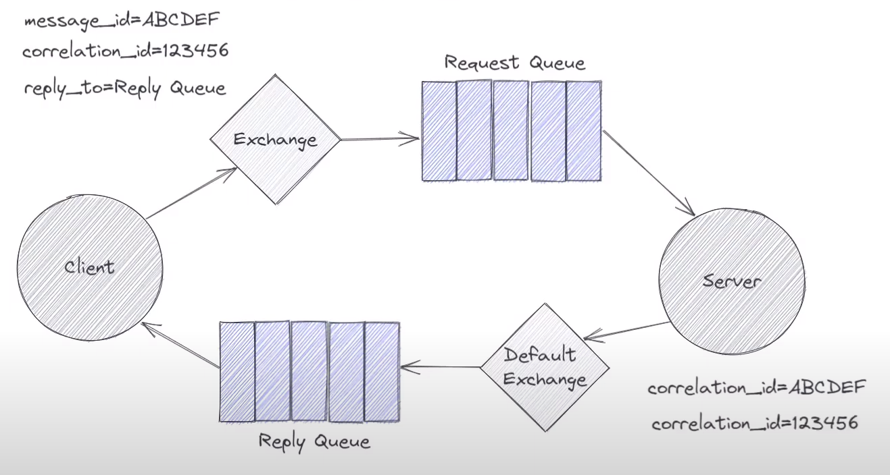

# Request - reply

- client sử dụng 1 thuộc tính là reply_to khi gửi request, để từ đó server biết sẽ gửi phản hồi vào queue nào
- Trong hình ảnh trên reply_to = Reply Queue, vậy sau khi xử lý message, server sẽ gửi phản hồi về queue tên là Reply Queue (sử dụng default exchange)

Q2: Làm thế nào để biết phản hồi naò ứng với request nào?

- Sử dụng message_id và corelation_id => tạo unique

### Chú ý cài đặt
#### Cài đặt client:

- tạo 1 reply_queue, tên queue này sẽ trở thành reply_to gửi tới server, và queue này để nhận response
- lúc client publish thì cần thiết lập reply_to và correlation_id (sinh từ uuid)
- channel.start_consuming() thay vì close() ngay (vì còn chờ reply)

#### Cài đặt server:
- Không cần tạo cor_id, cái này do client tạo
- thống nhất 1 request-queue với client, queue này dùng để nhận request từ client
- Thường là gửi phản hồi vào default exchange với tên queue là properties.reply_to

Trong trường hợp client khởi động trước, server chưa sẵn sàng, message gửi đi sẽ được giữ trong storage của message queue đến khi server hoạt động bình thường