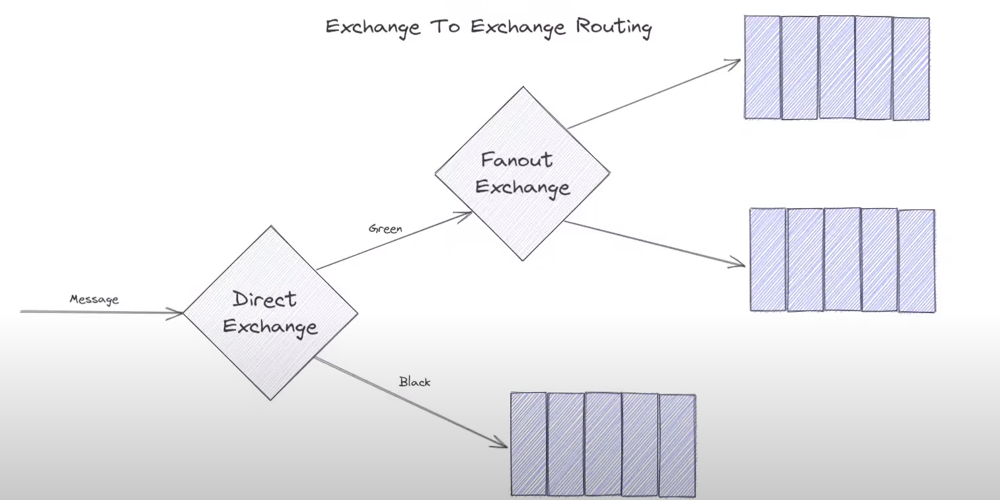
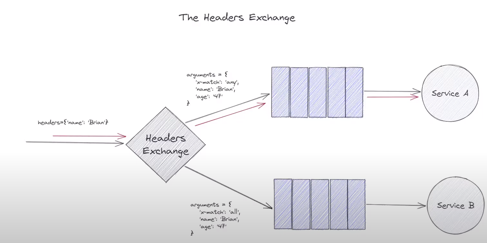
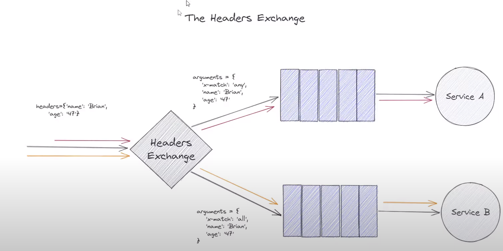
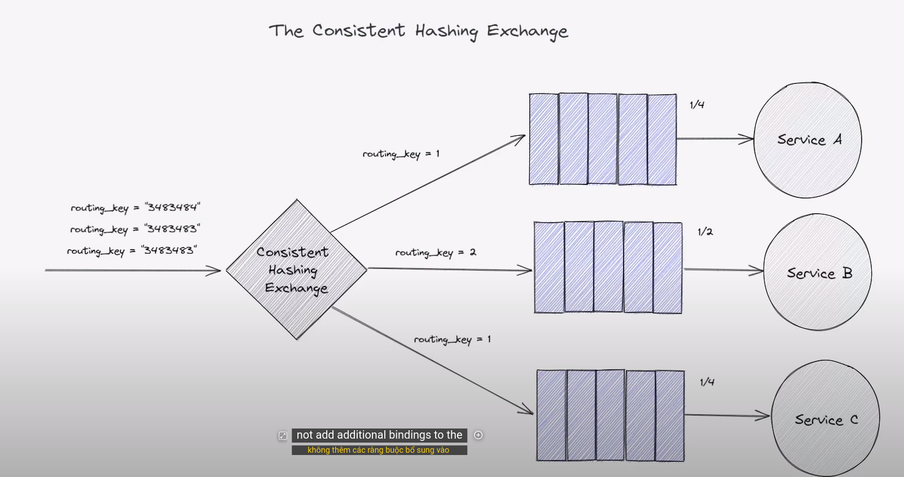

# Exchange To exchange Routing

Có thể có rất nhiều tổ hợp exchange khác nhau, có thể tạo ra dây chuyền/chuỗi các exchange nối tiếp nhau

Trong ví dụ này, có 1 message gửi tới direct exchange, sử dụng routing key để quyết định

# The Headers Exchange

Tương tự như routing nhưng sử dụng headers params thay vì routing key

- Trong ví dụ này arguments trong queue_bind để đến service A sử dụng 'x-match': 'any' giống như toán từ `OR`, chỉ cần headers thỏa mãn một trong các điều kiện, sẽ được gửi đến queue

- Trong ví dụ này arguments trong queue_bind để đến service B sử dụng 'x-match': 'all' giống như toán từ `AND`, headers phải thỏa mãn tất cả các điều kiện, message mới được gửi đến queue

# The Consistent Hashing Exchange

Mục đích để thực hiện giống competing consumers nhưng 1 consumers nào đó nhận nhiều message hơn so với các consumer khác

Gửi cùng 1 message (cùng 1 mã hash) thì sẽ luôn vào 1 queue nào đó

Khi routing_key càng lớn thì hash space càng lớn nên có nhiều khả năng vào queue đó hơn