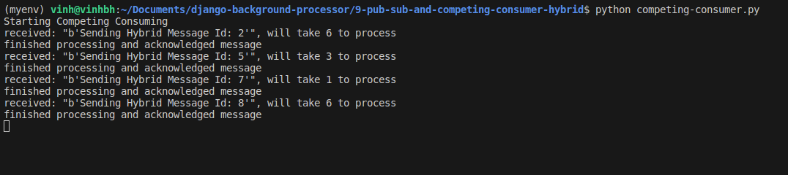

# 9. Pub/Sub and Competing consumers hybrid

Mục tiêu: Gửi 1 message tới đồng thời 2 queue khác nhau, trong đó

- queue thứ 1 ở dạng competing consumer (worker) với 2 instance nhận message từ queue, và 2 consumer có thời gian xử lý message ngẫu nhiên (random thời gian này)

- queue thứ 2 chỉ có 1 consumer bình thường nhận hết tất cả message được gửi từ producer

## Kịch bản triển khai:

- Sử dụng Fanout exchange để gửi message tới 2 queue cùng lúc
- Queue đầu tiên sẽ ở dạng competing consumer => Chạy 2 instance consumer này
- Queue thử hai sẽ ở dạng single bình thường

## Kết quả:

publish 10 message tại producer: 

Single consumer có 1 queue độc lập sẽ nhận được cả 10 message

Competing consumer thứ 1: Nhận được các message id là 1, 3, 4, 6, 9, 10

Competing consumer thứ 2: Nhận được các message id là 2, 5, 7, 8

## Kết quả trên rabbitMQ

## Chú ý:
- Đối với single consumer (không competing) thì có thể không cần đặt tên cho queue, để rabbit mq tự random tên

- Nhưng với conpeting consumers thì phải chỉ định rõ ràng tên queue, tránh trường hợp khi chạy 2 instance, rabbitmq tạo random 2 tên queue, không còn là cạnh tranh cùng 1 queue nữa