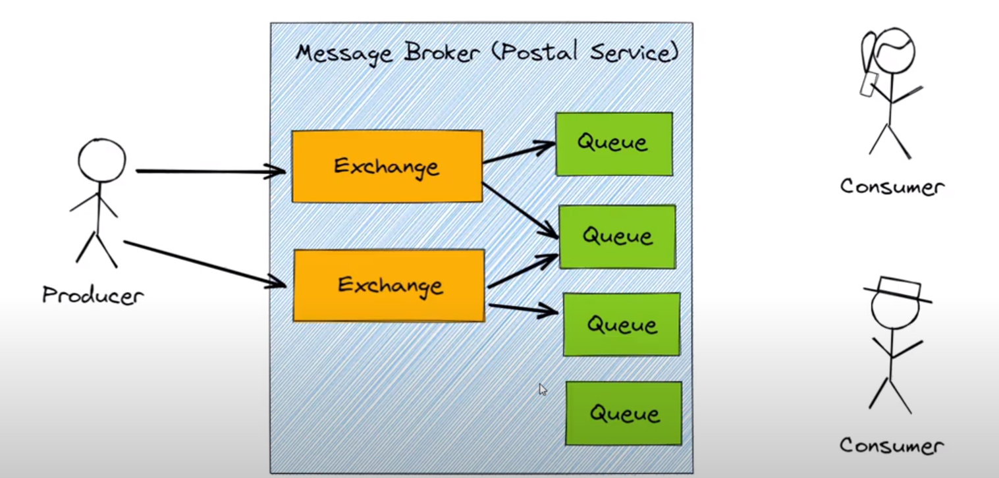
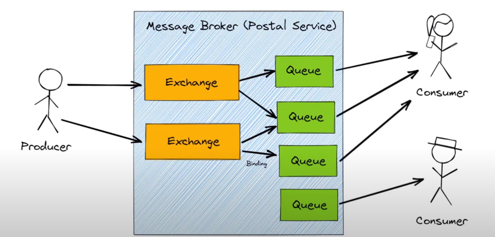
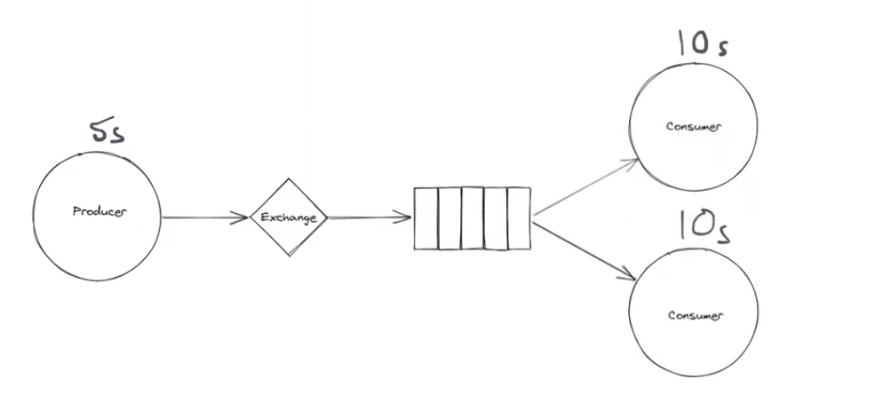
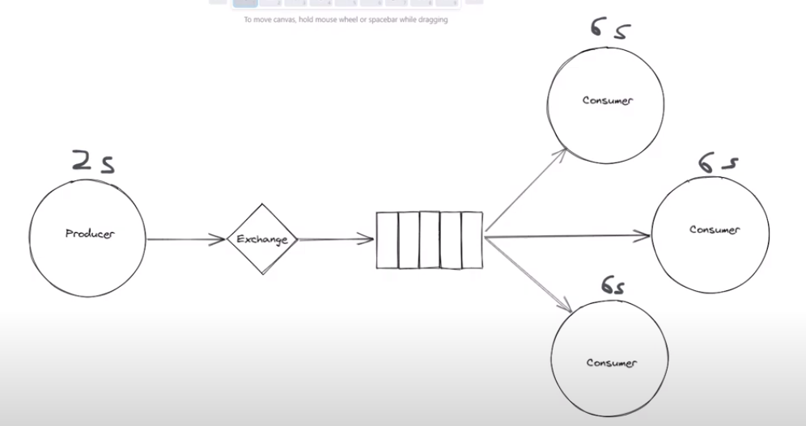
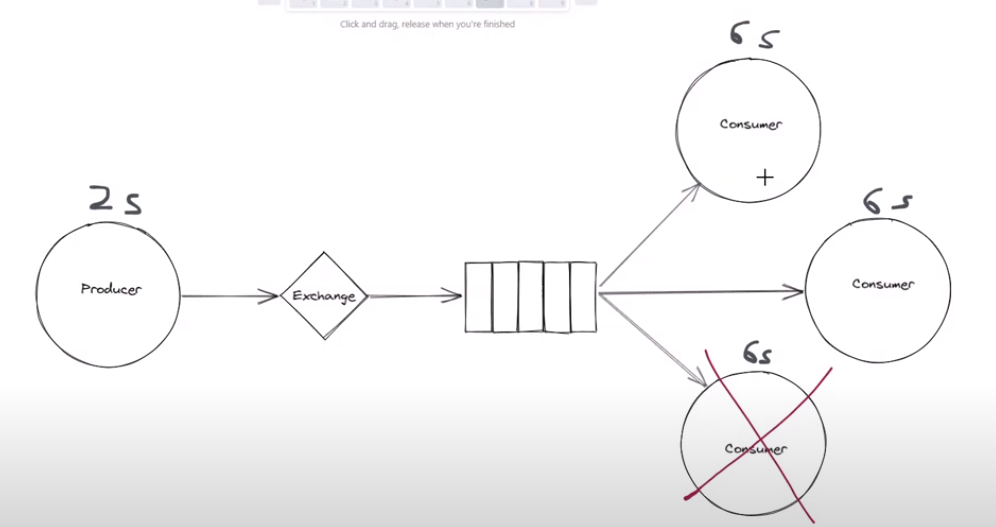
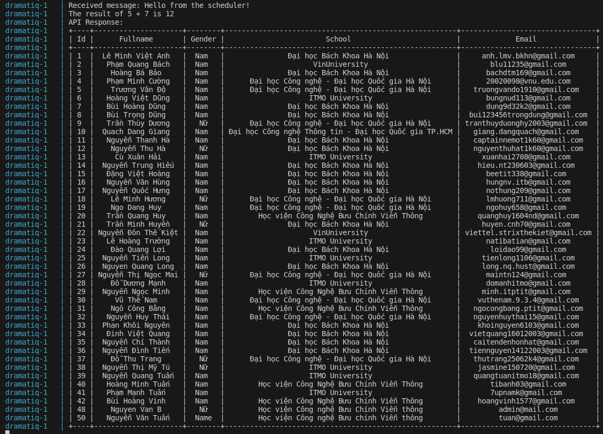

# django-background-processor

## Message Broker

### Vấn đề cần giải quyết:
app thứ 2 ko hoạt động
network bị chậm
sử dụng firewall
các app không dùng chung ngôn ngữ


### Giải quyết vấn đề khi có message broker:
What if app2 isn’t running? 
⇒ Message Brokers have storage

Nếu Application 2 đang ko running, các message gửi đến message broker sẽ được lưu lại tạm thời, đến khi app2 sống trở lại, các message sẽ được chuyển tiếp tới app2

Tạo tin cậy cho việc kết nối

If the network is slow?
⇒ MB have some storage

MB có thể lưu trữ các message nhận được và chưa gửi đi ngay cho app2

Có thể có nhiều hàng đợi với những tên gọi khác nhau


Có thể có 1 hàng đợi nhưng có nhiều app cùng gửi và nhận từ Queue
gọi là Competing Consumers

Nhận “next available message" từ Queue

Các consumers sẽ không nhận trùng message, nên sẽ ko làm trùng 1 việc
Do đó có thể scale được hệ thống bằng cách chạy nhiều instance và kết nối tới queue 


### Topic and subscription:

Làm thế nào muốn tất cả các receiving app đều nhận được cùng 1 message (trùng message)

⇒ Gửi vào 1 topic, topic này sẽ truyền message vào các queue khác nhau, các receiving app sẽ đăng ký các queue này


Nhưng nếu vẫn muốn Competing Consumers, lai hóa như sau:


### Publish / Subscribe
- Topics và Subsriptions là cơ bản cho PubSub pattern
- Pub/Sub là 1 pattern để tách rời Senders và Receivers 
- The sending app chỉ cần biết topic nào muốn gửi vào
- The receiving app chỉ cần biết topic nào cần subscribe vào
- Không cần biết gì về nhau
- Và topic thì thường dựa vào nghiệp vụ bài toán (ví dụ topic CustomerUpdated, OrderPlaced, … - bussiness function)


Handling Application Failures

#### Cơ chế Acknowledgements

- Có 4 message năm trong message broker

- Message 1 được gửi tới app2

- App2 process message 1, nếu thành công sẽ gửi lại thông báo xử lý thành công tới message broker

- Message broker nhận được tin là message 1 đã xử lý thành công, sẽ xóa message 1 khỏi hàng đợi và tiếp tục gửi message 2
…

- Nếu message 1 bị lỗi (do mạng hoặc do app 2 không hoạt động, v..v..)
Message broker sẽ không nhận được tin là message 1 đã xử lý thành công
Do đó, nó sẽ không gửi message 2 tới app 2

- Và khôi phục message 1 quay trở về đầu hàng đợi (ví dụ khi timeout expired)
Khi app 2 quay trở lại hoạt động bình thường, message broker sẽ gửi lại message 1 tới app 2
…

#### Acknowledgements on Subscriptions

Remember a subscription work like a Queue


# RabbitMQ

- asynchronously (do not follow the simple request-reply pattern, where we have to wait on replies)
- allows us to achieve great scale and reliability
- uses amqp as its default messaging protocol

Exchanges và Queues


Consumer có thể listen nhiều queue khác nhau hoặc không queue nào


Connection và Channel

1 connection có thể có nhiều channel, việc có nhiều channel giúp cho viêc có thể tạo và push message vào message broker bằng nhiều threads khác nhau, vì mỗi thread sử dụng 1 channel, do đó chúng cô lập với nhau

Bằng cách sử dụng nhiều channel thay vì nhiều connection, chúng ta có thể tiết kiệm được nhiều tài nguyên, tương tự với việc consumer có 1 connection nhưng có nhiều channels

## AMQP (The advanced message queuing protocol)

amqp uses a remote procedure call pattern to allow one computer for example client to execute programs or method on another computer, 

This communication is two-way and both the broker and the client can use or pc to run programs or call methods on each other

## Competing consumers

Sử dụng để phân bổ các công việc tốn thời gian giữa nhiều workers, vì vậy ý tưởng chính là đang có 1 task cần nhiều tài nguyên để hoàn thành (xử lý ảnh, machine learning, ...) những task mà phải chờ một thời gian để hoàn thành và không muốn client phải chờ đợi

Do đó, chúng ta đưa những task này vào work queue và các worker cho chạy ở chế độ nền (background) lấy các task ra và hoàn thành chúng

Khá phổ biến trong web/app khi http request thì rất ngắn

Ngoài ra có khả năng scale và tin cậy

Mặc định rabbitmq sử dụng round robin để gửi yêu cầu, trong trường hợp này là khá cân bằng


Ở trường hợp này, Nếu sử dụng round robin, khi consumer A mất 15s để hoàn thành, thì sẽ có thời điểm consumer A phải xử lý 2 message cùng lúc, trong khi consumer B thì đang free. Vì mặc định, message queue không quan tâm số lượng unackowleadged messages của 1 consumer 

Để overcome việc này, có thể set the prefetch value của 1 tin nhắn, điều này khiến cho rabbitmq không gửi nhiều hơn 1 message cùng lúc tới 1 worker. Từ đó message thứ 3 sẽ không gửi tới comsumer A mà sẽ dispatch tới consumer B (vì đang free)

Do đó cần setup cẩn thận để không rơi vào tình trạng trên


Để nhanh hơn có thể thêm các consumer vào queue


Nếu không may có 1 consumer down, thì vẫn còn 2 consumer khác xử lý, chỉ là sẽ chậm hơn chút (==> tính tin cậy)



Nếu set auto_ack = True, ngay khi lấy một message ra khỏi queue, sẽ tự động gửi acknowleadged và sẽ không cần thủ công gửi nó

Nhưng muốn thủ công gửi khi đã chắc chắn hoàn thành thì set auto_ack = False
## Cài đặt rabbitmq, dramatiq, apscheduler (python)

Cấu trúc thư mục:

```
.
├── docker-compose.yml
├── Dockerfile
├── README.md
├── requirements.txt
├── scheduler.py
└── tasks.py
```

Thư viện cần thiết (requirement.txt)
```
dramatiq
dramatiq[rabbitmq]
apscheduler
requests
tabulate # để log màn hình dạng bảng 
```

#### Chú ý, khi triển khai với docker compose, service dramatiq và scheduler phụ thuộc (depend on) vào service rabbitmq, nhưng chỉ sử dụng depend on là chưa đủ, cần sử dụng thêm healthcheck
Do đó trong Dockerfile phải cài thêm netcat-openbsd

### Kết quả
Truy cập thông qua browswer: (Account: guest/guest)


Đang setup lập lịch 20s thực hiện 1 lần 

Kết quả lấy các đối tượng trong hệ thống (gọi 1 api tới API Service) và hiển thị dạng bảng

